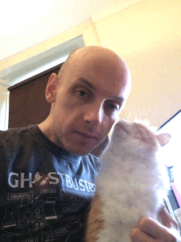

theme: Ostrich, 1

# Fighting Continuous Entropy
## Adventures in Continuous Delivery

@garyfleming

^ My name is... I am a...
^ The talk is called Fighting Continuous Entropy. When I have a talk called something like that, I have to accept that some of the audience, maybe most of you, don't know what entropy is. So let's start with something not technical (in the software sense)

---

# What is Entropy?

> "a thermodynamic quantity representing the unavailability of a system's thermal energy for conversion into mechanical work, often interpreted as the degree of disorder or randomness in the system."

^ I'm sure that has cleared that up.
^ I'll try to explain but, if you're a physicist, you'll probably disagree. That's fine. I'm simplifying for the benefit of everyone else, which means I'm going to be a bit wrong.

---

# What is Entropy?

> "Disorder of a system"

^ This is the important part, thought I suspect still a little abstract: More disorder means more possible states of a system. Entropy of the universe ONLY increases. Same of any closed system.
^ TODO still not convinced by this

<!-- ---

# Systems

^ TODO Does defining systems actually help? Taking it out for now.
^ Where parts come together to do something that the individual parts couldn't
^ TODO this is a crappy definition of a system. Tighten it up. -->

---

# System Experiment: Fishes

^ Imagine a polystyrene box. Place in it a piece of fish. Pack it up with ice. What happens?
^ It depends.
^ TODO IMAGES

---

# System Experiment: Fishes and Time

* 10 minutes?
* 10 hours?
* 10 days?
* 10000 years?

^ time is a key component of understanding entropy in systems. We might know (to some degree) the state of a system at some point, but over time it will change. Consider our fish box at these time scales. 10 minutes? Probably much the same. 10 hours? Ice will be melting but fish might be fine. 10 days? Fish will be rotten. 10000 years? The box will have started to breakdown.

---

# Software and Entropy

^ TODO rename slide?
^ So why have I been talking about entropy at all?
^ You might think that you write your software and put it into production and it'll remain the same forever. That's sadly not true. Code rots. It's a fish in a box, and the ice is melting.
^ What can we do to keep it cooler longer?

---

# Multi-faceted

^ We need to realise that there's no single solution to this problem. There are many. The best way of keeping our code living longer is to employ an arsenal of tooling, targeting different areas and different problems.

---

# Problem
## Knowing whether your software is releasable

^ Let's start with something that I'm hoping is very familiar. An easy starter.
^ If we want to know whether our software is starting to rot, the easiest thing we can do is release it. If we can release it frequently, we've got a really good starting point.

---

# Brief Intro to CI/CD

Continuous integration: All developers merge their code to a shared mainline at least once a day.

^ Like I say, this should be familiar to many so I won't be spending a great deal of time on it.
^ Continuous Integration... Build server ensures correctness. This pushes people towards good, advanced practice like Trunk Based Development. Problems come to light faster. This is a good thing. It's GOOD that you're suddenly getting a lot of merge conflicts -> Design conversations early. Rather than merge hell later.

---

# If it hurts, do it more often.

^ TODO consider pulling up to after multi-faceted/before the first problem
^ First read this mantra in Continuous Delivery (Humble, Farley). And it's the key revelation behind most of the practices I'll mention today: if something hurts, do it more often. You'll figure out your options for making it not hurt. For making it mundane. Boring.

---

# Brief Intro to CI/CD

## Continuous Delivery: all changes go to production; safely, quickly, and sustainably.

^ The gold standard here is that every commit that makes it through a CI build should be pushed to production. That can lead to hundreds of releases a week. Again, this
will generally be augmented by using build pipelines that check software is working, as well as practices like blue-green releases for zero downtime deploys.
^ The fact is that the peer-reviewed research in this space shows that teams that learn to do this delivery services faster and more reliably.

---

# Problem
## Dependency Updates

^ TODO acknowledge that dependencies are a key part of code rot. Make sure you store the dependencies you need (go light on this section). Not enough. They will have gained security vulnerabilities and patches, and become incompatible with outer layers - but taking updates is painful (ask how often people update dependencies?) -- This is the core problem. What happens if we did this way more often? Like Daily. (if it's hard do it more often)

---

# The Experiment

^ TODO Quick prototype in Java that updates dependencies on command. Asked a team to experiment by making a build job (update all, build/test, commit/fail). Learned some valuable lessons: mostly worked. Some Major version number changes would need manual intervention (could be excluded temporarily) but at least we now knew this.
^ TODO ancillary stuff: other exclusions around potential attack vectors, or major versions, libraries being abandoned (Hystrix)
^ TODO great automated tests are essential! All levels: unit, integration, end-to-end (mention spring security header upgrade issue)

---

# Continuous Regeneration/Rejuvenation

^ TODO Explain the naming of this technique

---

# Other languages

^ TODO can't be exhaustive here, but maybe reference Python, Ruby, and JS. Most languages have some dependency file or a dependency file and a lock file. If the former, need an update mechanism. If the latter, just blow away your lock file. Consider how you'll manage exclusions.

---

# Next Layer: Runtimes

^ TODO JVM version, NPM version, Ruby version. Consider using intermediary tooling like Jabba, RVM etc to allow you to test on newer versions. Need to be able to safely rollback to old version somehow.

---

# Language Change

^ TODO closely related to runtime but not identical. In particular think about big breaking changes. Python 2 -> 3: still not settled. Some orgs have many Python 2 apps so cost of change is high, plus some of those apps no longer have organisational understanding (more later). This is hard.

---

# VMs, Servers, etc

^ TODO problems here: long-lived VMs and servers get ad-hoc patches or break in subtle ways (network card)
^ TODO infrastructure as code, phoenix architecture, serverless etc

---

# People

^ TODO People will come and go. New people need to get up to speed. Teams will come and go. How do you make it resilient?

---

^ TODO general todo: make sure we're repeating the adage of "if its hard do it more"

---

# Thank You

@garyfleming
